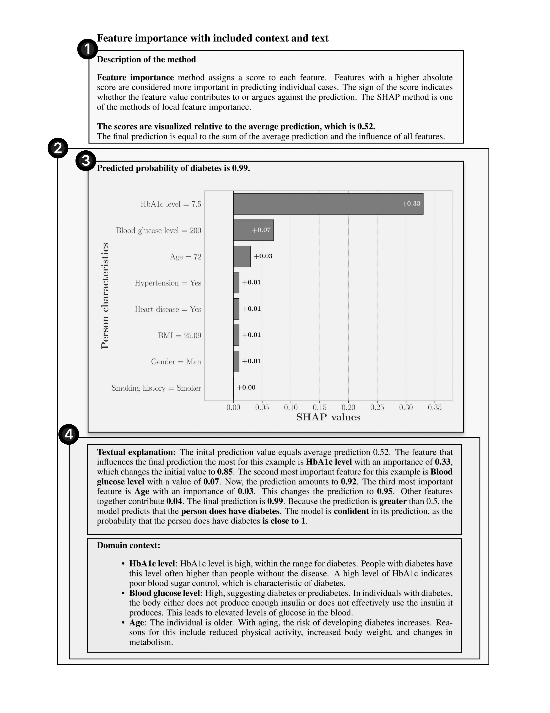

# ConteXAI - Contextualizing model's decisions with natural language explanations

## Project description
ConteXAI is a Python package developed as part of the Data Science Project Competition 2024. 

The library **links local explainability methods with natural language explanations**, allowing users to gain detailed insights into model predictions.
By incorporating additional domain knowledge, users can obtain even better insights into the model's predictions.

### Install

ConteXAI can be installed using pip:
```bash
pip install dscontexai
```

### Generate XAI reports

Using this library, you can fully automatically develop your XAI reports. Currently, it supports SHAP values, which is a local feature importance measure, to which we added textual explanations and domain-related context.
The library can be used for binary classification problems, for all models that output probabilities.

The report consists of four main segments: 

  (1) Description of local feature importances, 

  (2) Explanation of the instance's prediction, 

  (3) Visualization of local feature importances, 
  
  (4) Explanation of the visualization in natural language and context related to the domain and the prediction. 

<p align="center">
  
</p>


### Preparing configuration file
To use this tool with your model and dataset, you need to provide a configuration JSON file for a dataset, structured like the one below.

```bash
{
  # domain-based context
  "optimal_values": [
  ...
    [0, 6.5],               # HbA1c level optimal range is from 0 to 6.5
    [100, 140]              # Glucose level optimal range is from 100 to 140 
  ],
  "descriptions": {
    "below_optimal": [
      # Context for feature values falling below the optimal range
    ],
    "optimal": [
      # Context for feature values falling within the optimal range
    ],
    "above_optimal": [
      # Context for feature values falling above the optimal range
    ]
  },
  # Data transformations for feature mapping
  "transformation": {
    "0": ["Man", "Woman"],  # Transformation for Gender
    "1": [],                # No transformation for Age (numeric)
    "2": ["No", "Yes"],     # Transformation for Hypertension
    ...
  },
  "feature_names": [
    "Gender",
    "Age",
    "Hypertension",
    "Heart_disease",
    "Smoking_history",
    "BMI",
    "HbA1c_level",
    "Blood_glucose_level"
  ],
  # variables needed for structuring the description
  "target1": "diabetes",    # Target variable the model is predicting
  "target2": "Person",      # The object representing a sample in a data
  "supporting": ["does", "have"]  # Supporting verbs used in descriptions
}
```

### Running the report generation
Once you have model, dataset, and config file ready, to generate the report, you can use the following code snippet:
  
  ```python
  from dscontexai.generate_report import general

  general.generate_report(model_path= "path/to/model.pkl", dataset_path="path/to/data.csv", config="path/to/config.json", idx=sample_idx)
  ```

After successful generation, you will find a PDF report in the directory prototype/ under the name output_{sample_idx}.pdf.

#### Example notebooks

In folder [titanic/](./titanic), you can find an example of running a library on Titanic dataset for three different ensemble models: XGBoost, Random Forest, and CatBoost. See file [main.ipynb](./titanic/main.ipynb) for more clarification.

We also provide example of configuration file there, [titanic.json](/titanic/configurations/titanic.json).
 
#### Examples
Examples of the generated reports are shown below. Problem domain was diabetes prediction.

<p align="center">
  
  
</p>


